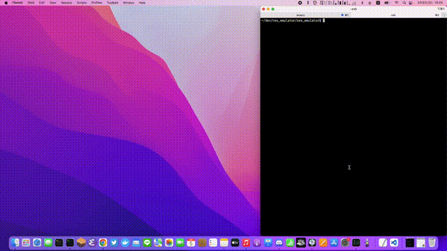

## ABOUT THIS
Hobby NES Emulator

- How to run

not work

- book

https://bugzmanov.github.io/nes_ebook/chapter_1.html

- 6502 reference

https://www.nesdev.org/obelisk-6502-guide/reference.html

- cargo test with std output

cargo test -- --nocapture

- finished

6502 CPU Instruction ✅

EZ 6502 CPU SNAKE GAME ✅

BUS ✅

Cartridges ✅

|Instructinon  |Check List|
|--------------|----------|
|ADC           | ✅       |
|AND           | ✅       |
|ASL           | ✅       |
|BCC           | ✅       |
|BCS           | ✅       |
|BEQ           | ✅       |
|BIT           | ✅       |
|BMI           | ✅       |
|BNE           | ✅       |
|BPL           | ✅       |
|BRK           | ✅       |
|BVC           | ✅       |
|BVS           | ✅       |
|CLC           | ✅       |
|CLD           | ✅       |
|CLI           | ✅       |
|CLV           | ✅       |
|CMP           | ✅       |
|CPX           | ✅       |
|CPY           | ✅       |
|DEC           | ✅       |
|DEX           | ✅       |
|DEY           | ✅       |
|EOR           | ✅       |
|INC           | ✅       |
|INX           | ✅       |
|INY           | ✅       |
|JMP           | ✅       |
|JSR           | ✅       | 
|LDA           | ✅       |
|LDX           | ✅       |
|LDY           | ✅       |
|LSR           | ✅       |
|NOP           | ✅       |
|ORA           | ✅       |
|PHA           | ✅       |
|PHP           | ✅       |
|PLA           | ✅       |
|PLP           | ✅       |
|ROL           | ✅       |
|ROR           | ✅       |
|RTI           | ✅       |
|RTS           | ✅       |
|SBC           | ✅       |
|SEC           | ✅       |
|SED           | ✅       |
|SEI           | ✅       |
|STA           | ✅       |
|STX           | ✅       |
|STY           | ✅       |
|TAX           | ✅       |
|TAY           | ✅       |
|TSX           | ✅       |
|TXA           | ✅       |
|TXS           | ✅       |
|TYA           | ✅       |

- TODO

6502 CPU Illegal Instruction

|Instructinon             |Check List|
|-------------------------|----------|
|AAC (ANC) [ANC] - (anc)  | ✅       |
|AAX (SAX) [AXS] - (sax)  | ✅       |
|ARR (ARR) [ARR] -        | ✅       |
|ASR (ASR) [ALR] - (alr)  | ✅       |
|ATX (LXA) [OAL] - (lxa)  | ✅       |
|AXA (SHA) [AXA] - (ahx)  | ✅       |
|AXS (SBX) [SAX] -        | ✅       |
|DCP (DCP) [DCM] -        | ✅       |
|DOP (NOP) [SKB] - (nop)  | ✅       |
|ISC (ISB) [INS] - (isb)  | ✅       |
|KIL (JAM) [HLT] - (nop?) | ✅       |
|LAR (LAE) [LAS] - (las)  | ✅       |
|LAX (LAX) [LAX] -        | ✅       |
|NOP (NOP) [NOP] -        | ✅       |
|RLA (RLA) [RLA] -        | ✅       |
|RRA (RRA) [RRA] -        | ✅       |
|SBC (SBC) [SBC] -        | ✅       |
|SLO (SLO) [ASO] -        | ✅       |
|SRE (SRE) [LSE] -        | ✅       |
|SXA (SHX) [XAS] - (shx)  | ✅       |
|SYA (SHY) [SAY] - (shy)  | ✅       |
|TOP (NOP) [SKW] - (nop)  | ✅       |
|XAA (ANE) [XAA] -        |          |
|XAS (SHS) [TAS] - (tas)  | ✅       |

PPU

APU

- MEMO

add path for sdl2, sdl2_image library in rust

export LIBRARY_PATH="$LIBRARY_PATH:/opt/homebrew/Cellar/sdl2/2.26.2/lib"

export LIBRARY_PATH="$LIBRARY_PATH:/opt/homebrew/Cellar/sdl2_image/2.6.2_2/lib"

changed load point 0x8000 => 0x0600 to make sure the CPU was complete and the game worked
